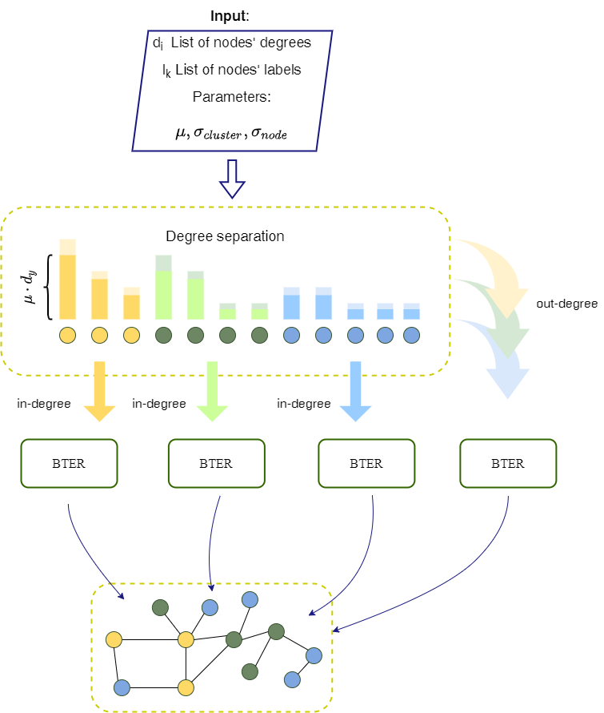

=============================
GraphGenerator 
=============================

.. start-badges
.. list-table::
   :stub-columns: 1

   * - package
     - | |pypi|
   * - tests
     - | |build| |coverage|
   * - docs
     - |docs|
   * - license
     - | |license|
   * - stats
     - | |downloads_stats|
   * - support
     - | |tg|
   * - languages
     - | |eng| |rus|
     - 
.. end-badges

**GraphGenerator** is an
open-source tool for generating Graphs structure.
It is based on `BTER <https://arxiv.org/pdf/1302.6636.pdf>`_ model and provides fair and representative graphs.
This graphs can be useful in Deep Graph Learning problems, e.g. you can use it in GNN benchmarking.

Core features
-------------

The overall scheme of the generator is presented on the picture:

* Degrees of nodes are generated and divided on ``in-degree`` and ``out-degree`` values to keep the desired assortativity - ``making_degree_dist()``
* These values are separated for blocks to keep the desired number of labels - ``making_clusters()`` or ``making_clusters_with_sizes()``
* For each group of nodes with the same label, the edges are generated according to ``BTER`` model on ``in-degree nodes`` - ``bter_model_edges()``
* At the end, ``edges on out-degrees`` are generated for all nodes at ones

Attributes are generated from normal distribution on node clusters adding noise from normal distribution:

Examples
--------

The usage is presented in ``BTER_tuning.ipynb``: As we are aim at graphs with given four graph characteristics,
so we tune all input hyperparameters of generator so that the generated graph corresponds
to the specified characteristics

License
-------
Lorem Ipsum

Contacts
--------
- egorshikov@itmo.ru write us to email and we will answer at your questions

Reference Paper
--------
Polina Andreeva, Egor Shikov and Claudie Bocheninа 
`"Attributed Labeled BTER-Based Generative Model for Benchmarking of Graph Neural Networks"  <http://www.mlgworkshop.org/2022/papers/MLG22_paper_5068.pdf>`_
Proceedings of the 17th International Workshop on Mining and Learning with Graphs (MLG) 2022:

@inproceedings{"mlg2022_5068",
    title={Attributed Labeled BTER-Based Generative Model for Benchmarking of Graph Neural Networks},
    author={Polina Andreeva, Egor Shikov and Claudie Bocheninа},
    booktitle={Proceedings of the 17th International Workshop on Mining and Learning with Graphs (MLG)},
    year={2022}}